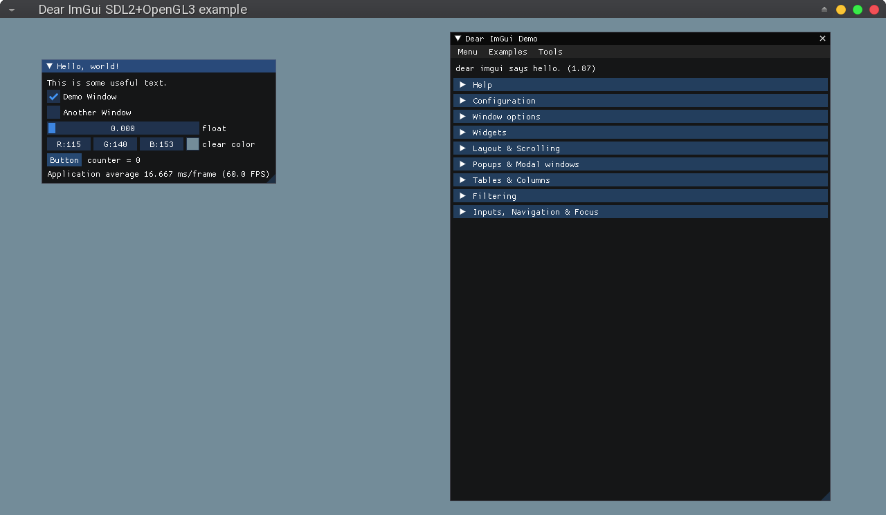

# cmake-sdl2-opengl-imgui
A minimal CMake/SDL2/OpenGL/Imgui project in VSCode showing how to incorporate
Imgui with the SDL2/OpenGL3 backend using CMake. Developed on Ubuntu 20.04.

Uses the code from
https://github.com/ocornut/imgui/tree/master/examples/example_sdl_opengl3

